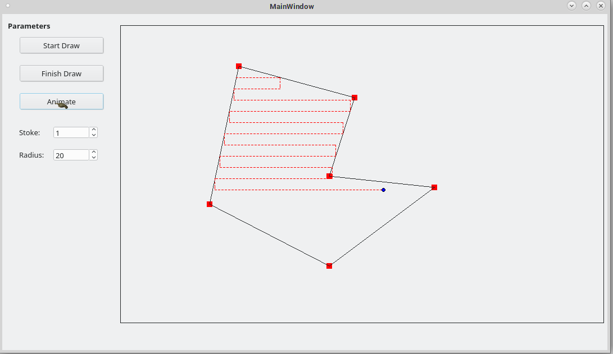

# qGPSMower
gps lawn mower + simulator

dual licence GPL
free upto first million then 5% royalty on GPS mow product sales

I had submitted my idea to Johndeer when GPS were first commercially available because they said they pay for new innovations. they ended up stealing my idea and paying me nothing. 

I decided to finish project myself, had came up with the idea when we got our first GPS while I was mowing lawns during highschool on a golfcourse style rideamower. 

can be scaled up in size for larger equiptment eventually.

basic project files for now, will convert to gcode or some other format to be used with arduino.

